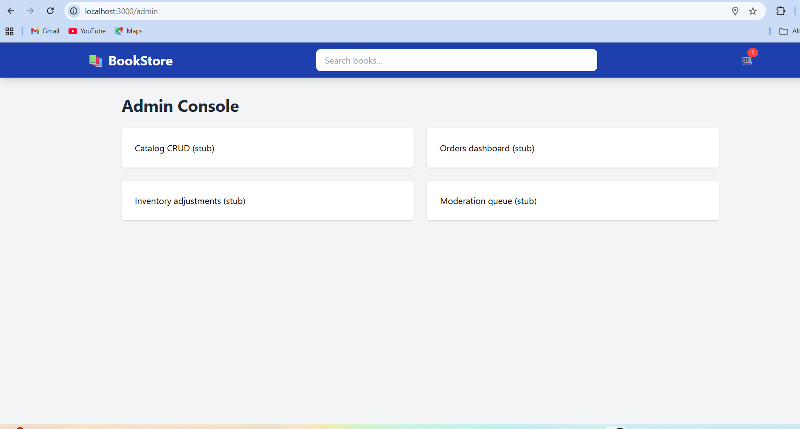
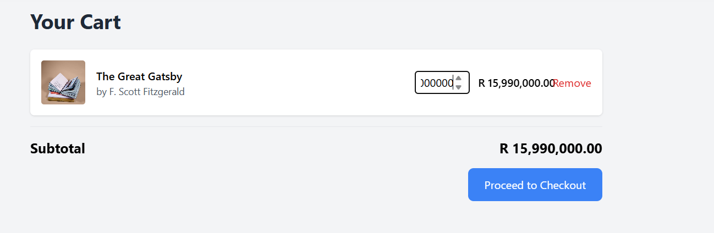

# Quality Queens Final Test Report for an E-commerce Bookstore Application
**Level:** Intermediate QA 
**Course:** Software Testing & Quality Assurance 
**Submission Date:** 2025-11-18
**Version:** 1.0.0

## Executive Summary
This report presents the results of comprehensive testing conducted on the Bookstore e-commerce application, version 1.0.0 from 0ctober 31, 2025 to November 18, 2025. The testing focused on validating core e-commerce functionality, including book browsing, shopping cart operations, the checkout and payment process, and basic admin inventory management.

### Key Findings:
- The application's core user journey i.e, searching for a book, adding it to the cart and completing checkout—is stable and functions correctly.
- Three Critical defects remain open, blocking the full operation of inventory management and cart stock validation.
- 82.9% of test cases passed, indicating a solid foundation but requiring fixes for key functionality before release.
- Automated tests using Selenium have been developed for the primary user workflows.

## Recommendation:
The QA team **DOES NOT RECOMMEND** release in the current state due to the presence of *Critical defects* in fundamental features (Admin CRUD, Stock Validation). A follow-up testing cycle is required after these issues are resolved.

### 1. Test Objective
The primary objective of this testing cycle was to evaluate the quality, functionality and usability of the E-commerce Bookstore application before its initial release. Specifically, our testing aimed to:
- Validate that all core e-commerce features function according to specifications, particularly book catalog browsing, search, shopping cart and Paystack payment integration.
- Ensure the application provides a consistent and responsive experience across different browsers and devices.

- Verify the security and validation of user inputs, especially in the checkout form and payment flow.
- Assess the functionality of the administrative interface for inventory management.

### 2. Areas Covered
#### 2.1 Functional Testing
The following functional areas were thoroughly tested:
- Book Catalog & Search
- Browsing all books
- Search by full title, partial keyword and author
- Case-insensitive search
- "No results" message handling
- Shopping Cart & Checkout
- Add/remove items
- Update item quantity
- Calculate subtotal, tax (8%) and total
- Form validation (required fields, email format)
- Order summary review
- Payment Processing
- Integration with Paystack gateway
- Handling of successful, failed and cancelled payments
- Currency support validation (NGN, GHS, USD, ZAR)
- Admin Inventory Management
- Admin authentication and authorization
- Create, Read, Update, Delete (CRUD) operations for books (Partially tested, major issues found)

#### 2.2 Non-Functional Testing
The following non-functional areas were tested:
- Compatibility Testing
Testing across Chrome v119, Firefox v118 and Edge v119
- Responsive design on standard PC, Tablet and Mobile screen sizes
- Usability Testing
- Navigation flow and intuitive design
- Clarity of error messages
- Security Hygiene
- Input validation on checkout form
  
### 3. Areas Not Covered
The following areas were not included in this testing cycle:
- Backend API Integration Testing
Reason: Focus of this cycle was on front-end functionality and user workflows.
- Performance/Load Testing
Reason: This is scheduled for a subsequent cycle after core functional issues are resolved.
- Full Accessibility Audit
Reason: Basic keyboard navigation was tested, but a full audit with screen readers is pending.
- Payment Gateway Security Penetration Testing
Reason: Relies on the security of the third-party Paystack service.

### 4. Testing Approach
#### 4.1 Test Strategy
Our testing approach combined manual and automated testing to ensure comprehensive coverage.
**Manual Testing:** The majority of test cases were executed manually to explore UI behavior and user experience thoroughly.
**Automated Testing:** Selenium with Python was used to automate key user journeys, including browsing, searching, adding to cart and the checkout process.
**Risk-Based Testing:** High-risk areas like payment processing and cart functionality received additional testing focus.

## 4.2 Testing Tools
The following tools were utilized during the testing process:
- **Test Management & Defect Tracking:** GitHub Projects & Issues
- **Automation Framework:** Selenium WebDriver with Python
- **IDE & Code Editor:** Visual Studio Code (VS Code)
- **Browser Testing:** Chrome v119, Firefox v118, Microsoft Edge v119
- **Evidence Collection:** Snipping Tool for screenshots

### 5. Defect Report
#### 5.1 Defect Summary
A total of 9 defects were identified during the testing cycle, categorized by severity as follows:
| Severity  | Count | Open |                      
| ----------- | ------------- | -------------- |
|Critical|4|4|
|Major|3|3|
|Minor|2|2|
|Total|9|9|

#### 5.2 Critical Defects (All Open)
- BUG-CART-04: Stock is unlimited
**Description:** Users can add any quantity of an item to the cart, with no validation against available stock.
**Impact:** Core business logic failure; could lead to selling non-existent inventory.
- BUG-ADMIN-01: Admin not able to do the CRUD operations
**Description:** Admin user cannot create, update or delete books in the inventory.
**Impact:** Renders the admin panel useless and prevents inventory management.
- BUG-ADMIN-02: Admin does not receive low-stock warnings
**Description:** The system does not alert admins when book stock is running low.
**Impact:** Risk of stockouts and missed sales opportunities.
- BUG-CART-01:Cart item deletion occurs without user confirmation
**Description:** Items are removed from the cart immediately upon clicking "Remove," risking accidental data loss.
**Impact:** Poor user experience and potential for frustration.
  
#### 5.3 Defect Trend Analysis
- Defects were logged consistently throughout the testing cycle, with a concentration of critical issues found in the Admin and Cart modules during the final execution phase. The open defect count remains high, indicating the application is not yet stable for release.

**Most Critical defect:** 

### 6. Test Environment
#### Client Environment:

- OS: Windows 10, Windows 11, Ubuntu 22.04
- Browsers: Chrome v119, Firefox v118, Edge v119
- Devices: Standard PC/Laptop, Tablet, Mobile (simulated)

#### Application Environment:
- Frontend: React, Tailwind CSS, JavaScript
- Backend API: Local development server (http://localhost:3000)
- Payment Gateway: Paystack Sandbox

### 7. Overall Status
#### 7.1 Testing Summary
**Test Cases Planned:** 41
**Test Cases Executed:** 41 (100%)
**Test Cases Passed:** 34 (82.9%)
**Test Cases Failed:** 7 (17.1%)
**Automation Coverage:** ~25% (Key user journeys covered by Selenium scripts)

#### 7.2 Quality Assessment
Based on our testing results, the E-commerce Bookstore application v1.0.0 shows promise but has significant quality gaps.

**Strengths:**
- The core user journey of finding a book and completing a purchase is functional.
- Search functionality is robust, supporting partial and case-insensitive queries.
- The UI is responsive and works correctly across different browsers and screen sizes.
- The Paystack payment integration works correctly for successful, failed and cancelled transactions.
  
**Areas of Concern:**
- Critical defects block essential business operations (inventory management) and data integrity (stock validation).
- The admin panel is currently non-functional.
- Lack of user confirmation for destructive actions (cart item deletion).

#### 7.3 Risk Assessment
The remaining risks associated with releasing the application are:
- Admin CRUD & Stock Validation (Critical): HIGH RISK
**Impact:** Prevents management of the product catalog and risks selling unavailable items.
**Mitigation:** Must be fixed before any release.
- Missing User Confirmations: MEDIUM RISK
**Impact:** Poor user experience leading to accidental data loss.
**Mitigation:** Should be addressed before release.
  
  

## 7.4 Release Recommendation & Risk-Based Mitigations
- Based on our comprehensive testing and the current status of the application, the QA team **DOES NOT RECOMMEND RELEASE** for Bookworm's Corner v1.0.0.
- The application must undergo another development cycle to address the critical defects. The following recommendations are provided to mitigate the identified risks and guide the path to a successful release:

### Recommendations Aligned with Risks:

| Identified Risk | Corresponding Recommendation |
| :--- | :--- |
| **1. HIGH RISK: Admin CRUD & Stock Validation (Critical)** | **a) Immediate Development Sprint:** Prioritize and fix the four Critical defects (`BUG-ADMIN-01`, `BUG-ADMIN-02`, `BUG-CART-04`, `BUG-CART-01`) as an absolute blocker for any release.   **b) Targeted Regression Testing:** After fixes are deployed, execute a focused regression test on the Admin panel and Cart modules. All test cases `TC-ADMIN-01` to `TC-ADMIN-05` and `TC-CART-05` must be re-executed and pass. |
| **2. MEDIUM RISK: Missing User Confirmations** | **Implement UX Safeguards:** Fix `BUG-CART-01` (cart deletion confirmation) to prevent user frustration and accidental data loss. This should be completed before the release candidate is ready. |
| **3. LOW RISK (Post-Fix): Minor UI & Validation Issues** | **Schedule a "Polish" Sprint:** Address minor defects (`BUG-CART-03`, `BUG-CHECKOUT-01`) and failed non-functional test cases (`TC-BOOK-08`, `TC-BOOK-09`, `TC-NFR-04`) after the critical blockers are resolved to enhance overall quality and user experience. |

### **Path to a "Release Recommended" Status:**

1.  **Immediate Goal (Go/No-Go Criteria):** All Critical defects must be fixed and verified. This is the non-negotiable prerequisite for any release.
2.  **Secondary Goal (Release Candidate):** All Major defects should be resolved. A full regression test pass must be achieved.
3.  **Final Goal (Production Release):** Upon successful completion of the above, the QA team will re-execute the test suite and issue a new report with a "Release Recommended" status, potentially with conditions for minor issues.

### 8. Requirements Traceability
The following table shows how key functional requirement areas were validated through testing:

|Requirement Area|Test Case IDs Covered	|Status|
| ----------- | ------------- | -------------- |
|FR-Catalog (Search/Filter/Sort)|	TC-BOOK-01 to TC-BOOK-10	|PASSED|
|FR-O01 (Cart Operations)|	TC-CART-01 to TC-CART-14|	PASSED*|
|FR-O02 (Checkout Wizard)	|TC-PAY-01 to TC-PAY-09|	PASSED|
|FR-O03 (Payment)|	TC-PAY-02 to TC-PAY-09|	PASSED|
|FR-M01 (Catalog CRUD)|	TC-ADMIN-01 to TC-ADMIN-05|	FAILED|
|FR-M02 (Inventory)|	TC-ADMIN-05, BUG-ADMIN-02|	FAILED|
|*PASSED with known Critical defects (BUG-CART-01, BUG-CART-04)|

### 9. Testing Challenges & Lessons Learned
#### 9.1 Challenges Encountered
- Admin Feature Access: Setting up admin privileges required manual local storage manipulation, which was not an end-user friendly process.
**Solution:** Used browser dev tools, but highlights the need for a proper login UI for admins.
- Payment Gateway Sandbox: Interacting with the Paystack iframe in automated tests was complex.
**Solution:** Implemented robust waits and context switching in Selenium scripts.

#### 9.2 Lessons Learned
- Early Admin Feature Testing: Admin features should be integrated and tested with a proper UI early in the cycle, not just via backdoors.
- Automation for Regression: The Selenium scripts created will be invaluable for rapid regression testing in future cycles.
-Clear Bug Triage: Daily synchronization between testers and developers is crucial for prioritizing and understanding critical bugs.

### 10. Appendices
#### 10.1 Test Case Execution Details: Detailed results are maintained in the provided Test Cases MD file.
#### 10.2 Defect Details: Complete details for all defects are available in the provided Defect Summary.
#### 10.3 Automated Test Scripts: The Selenium test scripts are available in the tests.py file

###  11. Approvals

| Role | Name | Approval Date | Signature | Notes |
|------|------|---------------|-----------|-------|
| Test Manager | Prisca Wamboka | | [P.W] | Cannot approve release due to critical open defects. |
| Risk Analyst | Ivy Nagide | 18/11/2025 | [I.V] | Confirms the identified risks and mitigation strategies documented in this report are accurate. |
| Test Executor | Thembisile Nkambule | 18/11/2025 | [T.N] | Confirms all test results and findings documented in this report are accurate.|
