# ✅ Test Cases — Online Bookstore System

## Legend

- **Role:** U (User), A (Admin)
- **FR Code:** Maps to functional requirements traced from SRS

---

# ✅ Test Cases — Online Bookstore System

## Legend

- **Role:** U (User), A (Admin)
- **FR Code:** Maps to functional requirements traced from SRS

---

### 1. Book Browsing & Search

| ID         |  Feature | Objective | Action | Actual Results| Expected Result | Status     |
| ---------- | ---------| ----------| -------| --------------| ----------------| ---------- |
| TC-BOOK-01 |View All Books from Home Page |Verify all books are displayed|Launch catalog | List of all the books sold | List of all the books sold  | Pass |
| TC-BOOK-02 |View Book Details|Book data exists|Launch catalog |id, title, author, description, price, image |id, title, author, description, price, image|  Pass |
| TC-BOOK-03 |Search book by full title|Verify Books seeded|Search "To Kill a Mockingbird" |Matching book(s) displayed| Matching book(s) displayed|  Pass|
| TC-BOOK-04 |Search using partial keyword|Verify Books seeded|Search "Kill" |Matching books with inserted keywords are displayed | Matching books with inserted keywords are displayed |  Pass |
| TC-BOOK-05 |Search case-insensitive|Verify search works regardless of letter case|Search “The Great Gatsby” vs “the great gatsby”|Both return same results|Both return same results| Pass|
| TC-BOOK-06 |Search by Author Name|Verify user can search by author|Search "Harper Lee"|Displays book(s) by Harper Lee|Displays book(s) by Harper Lee| Pass|
| TC-BOOK-07 |Clear Filters|Verify clearing filters displays full list|clear all on search|All books visible again|All books visible again| Pass
| TC-BOOK-08 |Sorting by price|Verify sorting by ascending price| Click “Sort by Price ↑”|Books not sortedfrom cheapest to most expensive|Books sorted from cheapest to most expensive| Fail|
| TC-BOOK-09 |Sort by Title alphabetical|Verify alphabetical sorting|Click “Sort by Title”|Books not sorted A - Z|Books sorted A - Z|Fail|
| TC-BOOK-10 |No Results Message|Validate message when search returns 0 results|Search nonexistent Book|error message "No books found matching your search"|error message "No books found matching your search"| Pass|

---

### 2. Shopping Cart

| ID         |  Feature | Objective | Action | Actual Results| Expected Result | Status     |
| ---------- | ---------| ----------| -------| --------------| ----------------|---------- |
| TC-CART-01 |Add a book to cart|Verify book can be added to cart |Click "Buy"|Book added to cart|Book added to cart| Pass|
| TC-CART-02 |View cart items|Verify that all added items appear on cart|Click cart icon|All items appear|All items appear| Pass|
| TC-CART-03 |Remove item from cart | Verify items can be removed from cart|Click "Remove"|item removed successfully|item removed successfully| Pass|
| TC-CART_04 |Update Quantity|Verify quantity can be increased or decreased|Click the increase/decrease quality|Quantity updates accordingly|Quantity updates accordingly| Pass|
| TC-CART-05 |Prevent Exceeding Stock|Verify user cannot exceed available stock|Increase quantity beyond stock|Quantity increases beyond stock|Error message: “Quantity exceeds available stock”| Fail|
| TC-CART-06 |Refresh doesn't delete cart data|Ensure cart data remains after page refresh|Add item and refresh page|Items remain in cart|Items remain in cart| Pass|
| TC-CART-07 |Calculate Subtotal|Verify subtotal = sum(price × qty)|Add multiple books|Subtotal correctly rounded to 2 decimal places|Subtotal correctly rounded to 2 decimal places| Pass|
| TC-CART-08 |Calculate Tax|Verify tax = 8% of subtotal|Add to cart and proceed to checkout|Tax displayed correctly rounded to 2 decimal places|Tax displayed correctly rounded to 2 decimal places| Pass|
| TC-CART-09 |Calculate Total|Verify total includes subtotal + tax + shipping|Add to cart and proceed to checkout|Total correctly within rounding tolerance|Total correctly within rounding tolerance|  Pass|
| TC-CART-10 |Apply Valid Coupon|Verify valid coupon applies discount|Enter valid coupon code|There's no place to apply coupon|Coupon successfully applied| Fail|
| TC-CART-11 |Validate Required Fields|Verify shipping form requires all fields|Leave field empty and click “Next”|Validation error "Please fill in this feild"|Validation error "Please fill in this feild"| Pass|
| TC-CART-12 |Validate Email Format|Verify proper email format required|Enter invalid email|Error message "Please include the @ in the amail address|Error message "Enter a valid email address| Pass|
| TC-CART-13 |Review Order Summary|Verify "review your order" shows correct details|Proceed to Review order step|Items, prices, tax, shipping and total displayed correctly|All order details visible| Pass|
| TC-CART-14 |Checkout with Empty Cart|Prevent checkout when cart is empty|Empty cart, click "Proceed to Checkout"|error message "Your cart is empty. Continue shopping", checkout button disabled|Button disabled or error shown| Pass|

-----
### 3. Checkout & Payment

| ID        |  Feature | Objective | Action | Actual Results| Expected Result | Status     |
| ----------| ---------| ----------| -------| --------------| ----------------| ---------- |
| TC-PAY-01 |Proceed to Checkout|Verify the button navigates to checkout|Click "Proceed to Checkout"|Checkout page displayed|Checkout page displayed| Pass|
| TC-PAY-02 |Initialize Paystack Payment|Verify payment gateway loads with correct total|Click "Proceed to payment"|Paystack gateway opens|Paystack gateway opens| Pass|
| TC-PAY-03 |Supported Currency Validation|Verify accepted currencies only (NGN, GHS, USD, ZAR)|Select supported currency|Payment proceeds successfully|Accepts all currencies and proceeds|  Pass|
| TC-PAY-04 |Unsupported Currency Handling|Verify unsupported currencies are blocked|Select unsupported currency e.g BWP|Error "We could not start this transaction. Currency not supported by merchant"|Error meassage "Incorrect currency"| Pass|
| TC-PAY-05 |Amount Conversion Precision|Ensure total is converted to minor units correctly|Pay with amount 199.99|Payment request in minor units|Exact conversion, no rounding errors| Pass|
| TC-PAY-06 |Cancel Payment|Verify system handles cancellation correctly|Open Paystack, Click "Back"|Payment cancelled|Payment cancelled| Pass|
| TC-PAY-07 |Payment Error Handling|Verify error messages for failed payments|Simulate network error|Error “Payment failed. Please try again.”|Error “Payment failed. Please try again.”| Pass|
| TC-PAY-08 |Successful Payment|Verify order updates after successful payment|Click "Pay Now"|Message "Successfully paid",Order status updates to “Paid”|Message "Successfully paid"| Pass |
|TC-PAY-09|Emailed paystack receipt|Verify an email is sent after successful purchase|Click "Success" paystack on payment flow|Email is succesfully received|Email is succesfully received| Pass|

---

### 4. Admin Inventory Management

| ID        |  Feature | Objective | Action | Actual Results| Expected Result | Status     |
| ----------| ---------| ----------| -------| --------------| ----------------| ---------- |
| TC-ADMIN-01 |Admin Login|Verify admin can login|Login with admin credentials|Redirects to Admin Dashboard|Redirects to Admin Dashboard| Pass|
| TC-ADMIN-02 |Unauthorized User Blocking|Verify non-admin cannot access /admin|Login as regular user|------|Error "Unauthorised user" | ----|
| TC-ADMIN-03 |Add New Book|Verify admin can create new item|Go to Inventory, Add book, Save|New book cannot be added|Book saved and visible|  Fail|
| TC-ADMIN-04 |Edit Book Details|Verify existing book can be updated|Select book, Edit, Save|Cannot update book details|Changes persist successfully| Fail| 
| TC-ADMIN-05 |Delete Book| Verify admin can delete inventory item|Select book, click Delete|Cannot Delete a book|Book removed from list| Fail|

-----

### 5. Non‑Functional Requirements
| ID        |  Feature | Objective | Action | Actual Results| Expected Result |  Test  | Status     |
| ----------| ---------| ----------| -------| --------------| ----------------|------- | ---------- |
| TC-NFR-01 |Responsive Design|Verify can work in every screen size|Test on mobile, tablet, desktop, large screen|Layout adapts correctly with no overlap|Layout adapts correctly with no overlap|Compatibility Testing| Pass|
| TC-NFR-02 |Form Validation|Prevent incorrect or empty data|Submit empty/invalid form|Form does not submit,shows error messages|Display error message|Security Hygiene| Pass|
| TC-NFR-03 |Keyboard Navigation|Ensure all UI is accessible via keyboard|Navigate entire site using Tab, Shift+Tab, Enter, Space|Navigate successfully|Navigate successfully|Accessibility Testing| Pass|
| TC-NFR-04 |Lazy Loading|Ensure images load lazily|Inspect network tab while scrolling|Images load only when in viewport|Performance Testing| Fail|

---

## ✅ Detailed Test Cases — Online Bookstore System

---

## 1. Catalog & Search

###  Book Browsing & Search

- **ID:** TC-BOOK-01
- **Title:** Verify all books are displayed
- **Pre-conditions:** Application running; user is on `/catalog`
- **Steps:**
  1. Navigate to `/catalog`
- **Expected Result:** List of all the books sold
- **Post-conditions:** None
- **Evidence:** 

- **ID:** TC-BOOK-02
- **Title:** All books data is displayed
- **Pre-conditions:** Catalog contains searchable book titles
- **Steps:**
  1. Navigate to `/catalog`
  2. Navigate to a book 
- **Expected Result:** id, title, author, description, price, image
- **Post-conditions:** None
- **Evidence:** 

- **ID:** TC-BOOK-03
- **Title:** Search book by full title
- **Pre-conditions:** Catalog loaded
- **Steps:**
  1. Navigate to `/catalog`
  2. Click on the search bar
  3. type "To Kill a Mockingbird"
- **Expected Result:** Displays "To Kill a Mockingbird"
- **Post-conditions:** None
- **Evidence:** 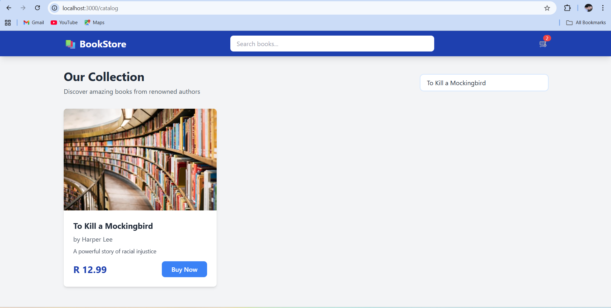

- **ID:** TC-BOOK-04
- **Title:** Search using partial keyword
- **Pre-conditions:** Catalog loaded
- **Steps:**
  1. Navigate to `/catalog`
  2. Click on the search bar
  3. type "kill"
- **Expected Result:** Displays books with keyword "Kill"
- **Post-conditions:** None
- **Evidence:**  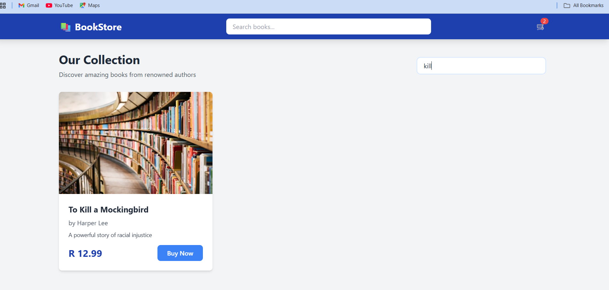

- **ID:** TC-BOOK-05
- **Title:** Search case-insensitive
- **Pre-conditions:** Catalog loaded
- **Steps:**
  1. Navigate to `/catalog`
  2. Click on the search bar
  3. type "The Great Gatsby"
  4. type "the great gatsby"
- **Expected Result:** Displays "To Kill a Mockingbird"
- **Post-conditions:** None
- **Evidence:**  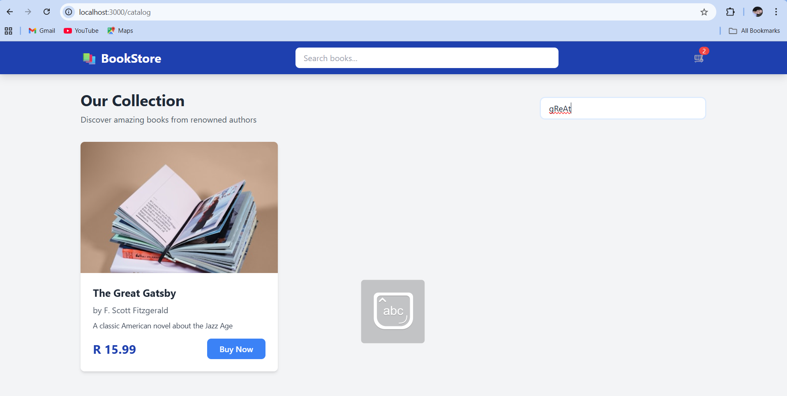

- **ID:** TC-BOOK-06
- **Title:** Search by Author Name
- **Pre-conditions:** Catalog loaded
- **Steps:**
  1. Navigate to `/catalog`
  2. Click on the search bar
  3. type "Harper Lee"
- **Expected Result:** Displays book(s) by "Harper Lee"
- **Post-conditions:** None
- **Evidence:**  

- **ID:** TC-BOOK-07
- **Title:** Clear filter
- **Pre-conditions:** Catalog loaded
- **Steps:**
  1. Navigate to `/catalog`
  2. Click on the search bar
  3. type "To Kill a Mockingbird"
  4. Clear filter
- **Expected Result:** All books visible again
- **Post-conditions:** None
- **Evidence:** 

- **ID:** TC-BOOK-08
- **Title:** Sorting by price
- **Pre-conditions:** Catalog loaded
- **Steps:**
  1. Navigate to `/catalog`
- **Expected Result:** Books sorted from cheapest to most expensive
- **Post-conditions:** None
- **Evidence:**  

- **ID:** TC-BOOK-09
- **Title:** Sort by Title alphabetically
- **Pre-conditions:** Catalog loaded
- **Steps:**
  1. Navigate to `/catalog`
- **Expected Result:** Books sorted A - Z
- **Post-conditions:** None
- **Evidence:**  

- **ID:** TC-BOOK-10
- **Title:** Validate error message when search returns 0 results
- **Pre-conditions:** Catalog loaded
- **Steps:**
  1. Navigate to `/catalog`
  2. Click on the search bar
  3. type "Zulu myths"
- **Expected Result:** Displays "To Kill a Mockingbird"
- **Post-conditions:** None
- **Evidence:**  

## 2. Shopping Cart

- **ID:** TC-CART-01
- **Title:** Add Book to Cart
- **Pre-conditions:** Catalog page open
- **Steps:**
  1. Navigate to `/catalog`
  2. Click "Buy Now"
- **Expected Result:** Book added to cart
- **Post-conditions:** Cart stored in localStorage.
- **Evidence:**  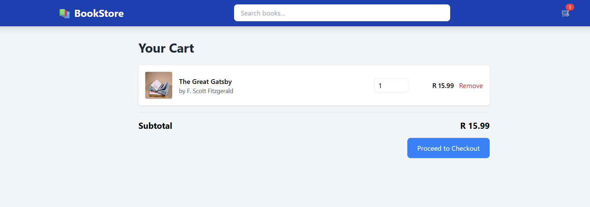

- **ID:** TC-CART-02
- **Title:** Verify that all added items appear on cart
- **Pre-conditions:** Cart contains ≥ 1 item
-  **Steps:**
  1. Navigate to `/catalog`
  2. Click "Buy Now" on a book
  3. Click "Buy Now" on another book
  4. Click the cart icon
- **Expected Result:** All items appear
- **Post-conditions:** Updated cart stored in localStorage.
- **Evidence:**  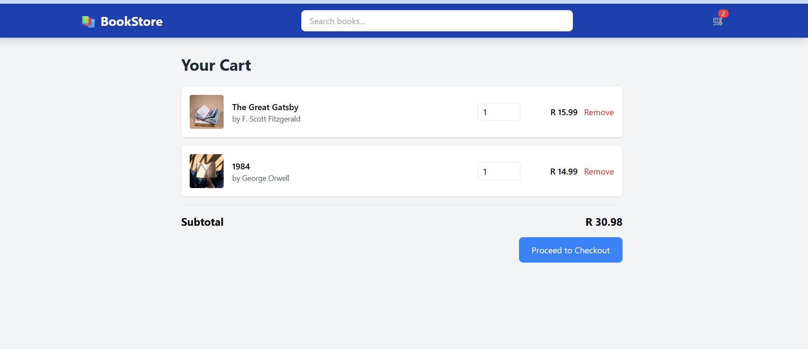

- **ID:** TC-CART-03
- **Title:** Remove item from cart 
- **Pre-conditions:** Cart contains ≥ 1 item
- **Steps:**
  1. Navigate to `/catalog`
  2. Click "Buy Now" on a book
  3. Click "Buy Now" on another book
  4. Click the cart icon
  5. Click "Remove" one an item
- **Expected Result:** Item removed successfully
- **Post-conditions:** Cart state updated.
- **Evidence:**  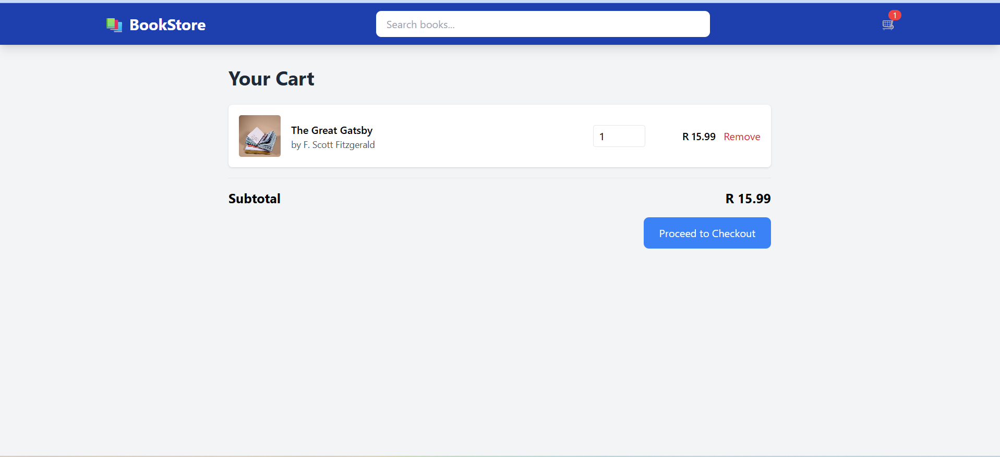

- **ID:** TC-CART-04
- **Title:** Update Quantity
- **Pre-conditions:** Cart contains ≥ 1 item
- **Steps:**
  1. Navigate to `/catalog`
  2. Click "Buy Now" on a book
  3. Click "Buy Now" on another book
  4. Click the cart icon
  5. Click on add quantity
- **Expected Result:** Quantity updates accordingly
- **Post-conditions:** Cart state updated.
- **Evidence:** 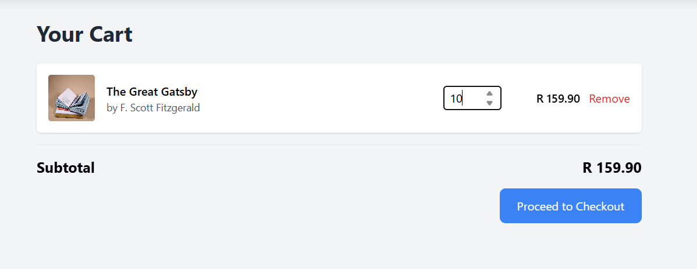

- **ID:** TC-CART-05
- **Title:** Prevent Exceeding Stock
- **Pre-conditions:** Cart contains ≥ 1 item
- **Steps:**
  1. Navigate to `/catalog`
  2. Click "Buy Now" on a book
  3. Click "Buy Now" on another book
  4. Click the cart icon
  5. Click add quantity
  6. Type 1000000(1 million)
- **Expected Result:** Error message: “Quantity exceeds available stock”
- **Post-conditions:** Cart state updated.
- **Evidence:**  

- **ID:** TC-CART-06
- **Title:** Ensure cart data remains after page refresh
- **Pre-conditions:** Cart contains ≥ 1 item
- **Steps:**
  1. Navigate to `/catalog`
  2. Click "Buy Now" on a book
  3. Click "Buy Now" on another book
  4. Click the cart icon
  5. Click refresh
- **Expected Result:** Items remain in cart
- **Post-conditions:** Cart state updated.
- **Evidence:**  

- **ID:** TC-CART-07
- **Title:** Verify subtotal = sum(price × qty)
- **Pre-conditions:** Cart contains ≥ 1 item
- **Steps:**
  1. Navigate to `/catalog`
  2. Click "Buy Now" on a book
  3. Click "Buy Now" on another book
  4. Click the cart icon
- **Expected Result:** Subtotal correctly rounded to 2 decimal places
- **Post-conditions:** Cart state updated.
- **Evidence:**  

- **ID:** TC-CART-08
- **Title:** Verify tax = 8% of subtotal
- **Pre-conditions:** Cart contains ≥ 1 item
- **Steps:**
  1. Navigate to `/catalog`
  2. Click "Buy Now" on a book
  3. Click "Buy Now" on another book
  4. Click the cart icon
  5. Click on "Proceed to checkout"
  6. Fill in the form
  7. Click "Next"
- **Expected Result:** Tax displayed correctly rounded to 2 decimal places
- **Post-conditions:** Cart state updated.
- **Evidence:**  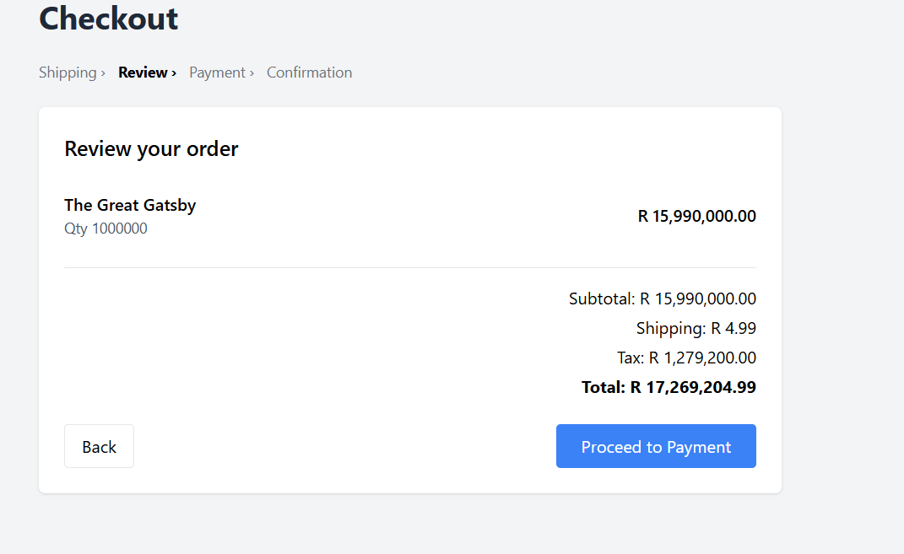

- **ID:** TC-CART-09
- **Title:** Verify total includes subtotal + tax + shipping
- **Pre-conditions:** Cart contains ≥ 1 item
- **Steps:**
  1. Navigate to `/catalog`
  2. Click "Buy Now" on a book
  3. Click "Buy Now" on another book
  4. Click the cart icon
  5. Click on "Proceed to checkout"
  6. Fill in the form
  7. Click "Next"
- **Expected Result:** Total correctly within rounding tolerance
- **Post-conditions:** Cart state updated.
- **Evidence:**  

- **ID:** TC-CART-10
- **Title:** Verify valid coupon applies discount
- **Pre-conditions:** Cart contains ≥ 1 item
- **Steps:**
  1. Navigate to `/catalog`
  2. Click "Buy Now" on a book
  3. Click "Buy Now" on another book
  4. Click checkout icon
  5. Click on "Proceed to checkout"
  6. Fill in the form
  7. Click "Next"
- **Expected Result:** Coupon successfully applied
- **Post-conditions:** Cart state updated. Test unsuccessful
- **Evidence:**  

- **ID:** TC-CART-11
- **Title:** Verify shipping form requires all fields
- **Pre-conditions:** Cart contains ≥ 1 item
- **Steps:**
  1. Navigate to `/catalog`
  2. Click "Buy Now" on a book
  3. Click "Buy Now" on another book
  4. Click the cart icon
  5. Click on "Proceed to checkout"
  6. Fill some fields and leave some empty
- **Expected Result:** Validation error "Please fill in this feild"
- **Post-conditions:** Cart state updated.
- **Evidence:**  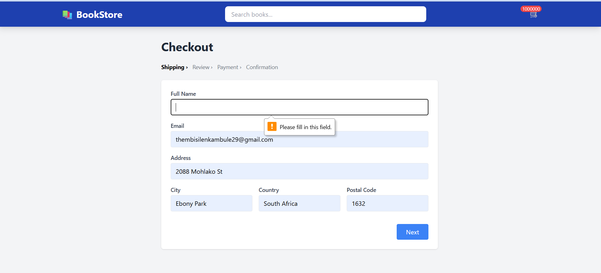

- **ID:** TC-CART-12
- **Title:** Verify proper email format required
- **Pre-conditions:** Cart contains ≥ 1 item
- **Steps:**
  1. Navigate to `/catalog`
  2. Click "Buy Now" on a book
  3. Click "Buy Now" on another book
  4. Click the cart icon
  5. Click on "Proceed to checkout"
  6. Do not add the @ symbol on email address e.g "thembi.gmail.com"
- **Expected Result:** Error message "Please include the @ in the amail address
- **Post-conditions:** Cart state updated.
- **Evidence:**  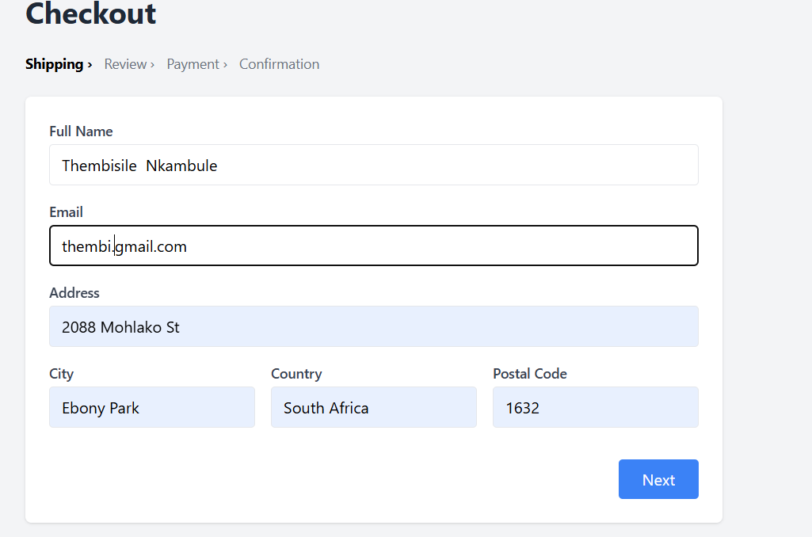

- **ID:** TC-CART-13
- **Title:** Verify "review your order" shows correct details
- **Pre-conditions:** Cart contains ≥ 1 item
- **Steps:**
  1. Navigate to `/catalog`
  2. Click "Buy Now" on a book
  3. Click "Buy Now" on another book
  4. Click the cart icon
  5. Click on "Proceed to checkout"
  6. Fill in the form
  7. Click "Next"
- **Expected Result:** All order details visible
- **Post-conditions:** Cart state updated.
- **Evidence:**  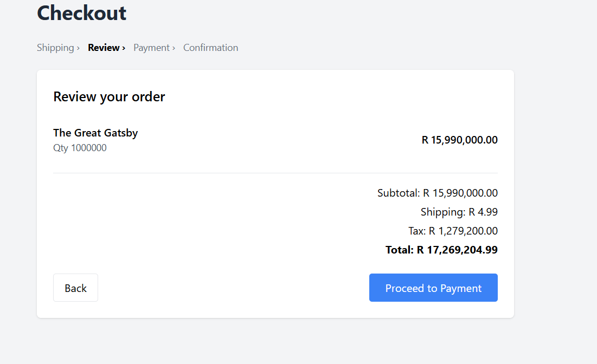

- **ID:** TC-CART-14
- **Title:** Prevent checkout when cart is empty
- **Pre-conditions:** Cart contains ≥ 1 item
- **Steps:**
  1. Navigate to `/catalog`
  2. Click "Buy Now" on a book
  3. Click "Buy Now" on another book
  4. Click the cart icon
- **Expected Result:** error message "Your cart is empty. Continue shopping", checkout button disabled
- **Post-conditions:** Cart state updated.
- **Evidence:**  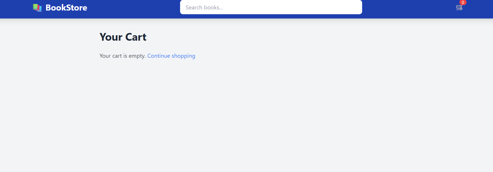

## 3. Checkout & Payment

- **ID:** TC-PAY-01
- **Title:** Verify the button navigates to checkout
- **Pre-conditions:** Cart contains ≥ 1 item
- **Steps:**
  1. Navigate to `/cart`
  2. Click "Proceed to Checkout"
- **Expected Result:** Redirect to `/checkout` with order summary.
- **Post-conditions:** Checkout session initialized.
- **Evidence:**  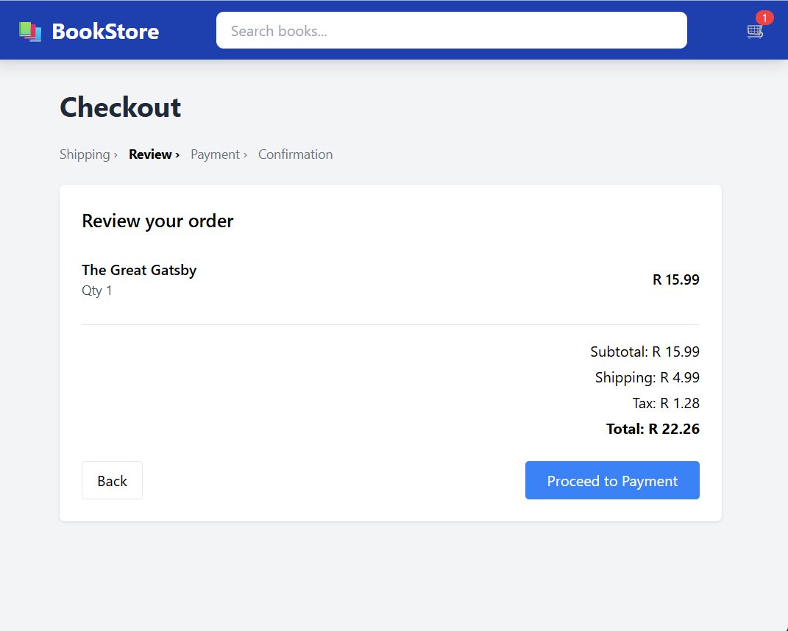

- **ID:** TC-PAY-02
- **Title:** Verify payment gateway loads with correct total
- **Pre-conditions:** Invalid / missing Paystack key in `.env`
- **Steps:**
  1. On `/cart`
  2. Click "Proceed to Checkout"
  3. Fill in the form
  4. Click "Next"
- **Expected Result:** Paystack gateway opens
- **Post-conditions:** 
- **Evidence:**  

- **ID:** TC-PAY-03
- **Title:** Verify accepted currencies only (NGN, GHS, USD, ZAR)
- **Pre-conditions:** Invalid / missing Paystack key in `.env`
- **Steps:**
  1. On `/cart`
  2. Click "Proceed to Checkout"
  3. Fill in the form
  4. Click "Next"
- **Expected Result:** Accepts all declared currencies and proceeds
- **Post-conditions:** 
- **Evidence:**

- **ID:** TC-PAY-04
- **Title:** Verify unsupported currencies are blocked
- **Pre-conditions:** Invalid / missing Paystack key in `.env`
- **Steps:**
  1. Set incorrect currency on currency.js file
  2. On `/cart`
  3. Click "Proceed to Checkout"
  4. Fill in the form
  5. Click "Next"
  6. Click "Proceed to Payment"
  7. Click "Pay Now"
- **Expected Result:** Error meassage "Incorrect currency"
- **Post-conditions:** 
- **Evidence:**  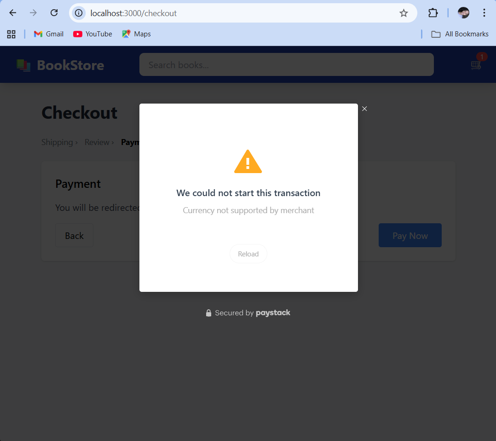

- **ID:** TC-PAY-05
- **Title:** Ensure total is converted to minor units correctly
- **Pre-conditions:** Invalid / missing Paystack key in `.env`
- **Steps:**
  1. On `/cart`
  2. Click "Proceed to Checkout"
  3. Fill in the form
  4. Click "Next"
- **Expected Result:** Payment request in minor units|Exact conversion, no rounding errors
- **Post-conditions:** 
- **Evidence:**  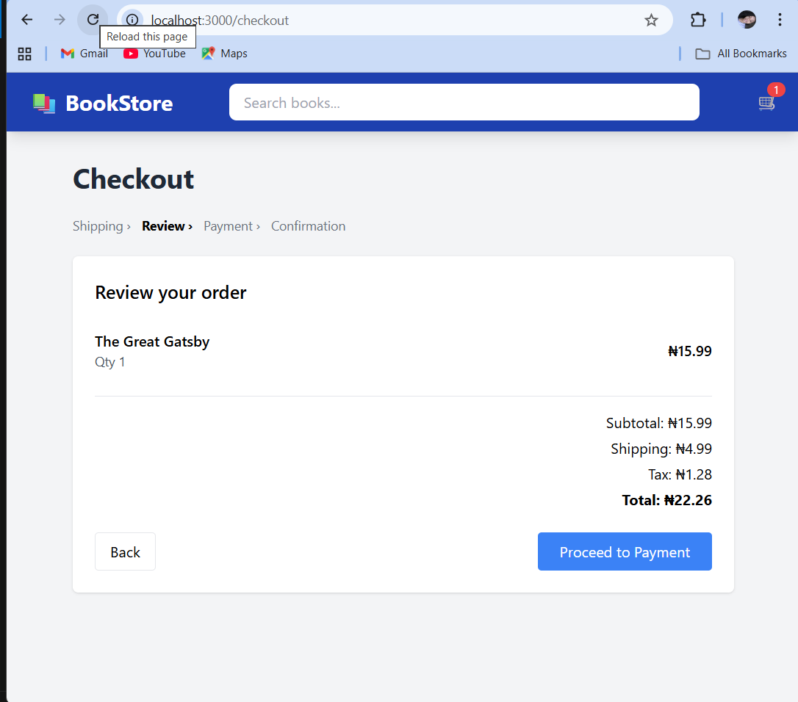

- **ID:** TC-PAY-06
- **Title:** Verify system handles cancellation correctly
- **Pre-conditions:** Invalid / missing Paystack key in `.env`
- **Steps:**
  1. On `/cart`
  2. Click "Proceed to Checkout"
  3. Fill in the form
  4. Click "Next"
  5. Click "Proceed to Payment"
  6. Click "Pay Now"
  7. Click "Back"
- **Expected Result:** Payment cancelled
- **Post-conditions:** 
- **Evidence:**  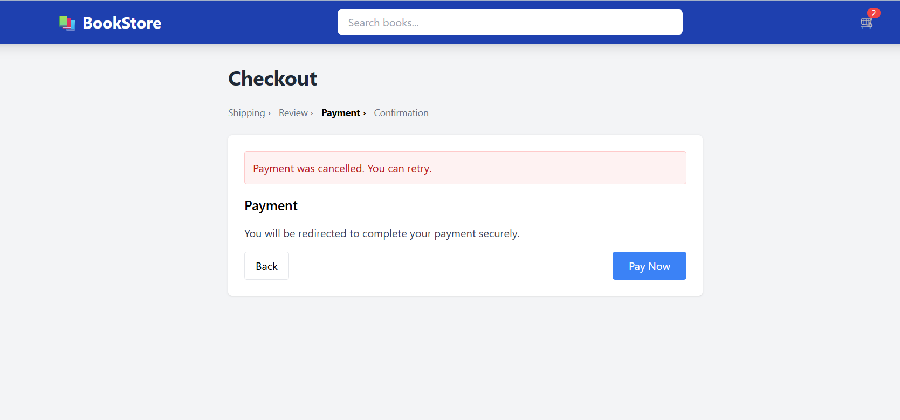

- **ID:** TC-PAY-07
- **Title:** Verify error messages for failed payments
- **Pre-conditions:** Invalid / missing Paystack key in `.env`
- **Steps:**
  1. On `/cart`
  2. Click "Proceed to Checkout"
  3. Fill in the form
  4. Click "Next"
  5. Click "Proceed to Payment"
  6. Click "Pay Now"
  7. Click "Back"
- **Expected Result:** Error “Payment failed. Please try again.”
- **Post-conditions:** 
- **Evidence:**  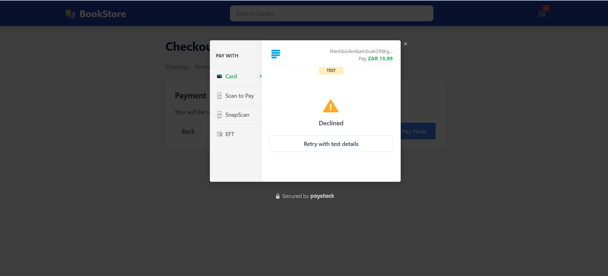

- **ID:** TC-PAY-08
- **Title:** Verify order updates after successful payment
- **Pre-conditions:** Invalid / missing Paystack key in `.env`
- **Steps:**
  1. On `/cart`
  2. Click "Proceed to Checkout"
  3. Fill in the form
  4. Click "Next"
  5. Click "Proceed to Payment"
  6. Click "Pay Now"
  7. Click "Card"
  8. Click "Success"
- **Expected Result:** Message "Successfully paid"
- **Post-conditions:** 
- **Evidence:**  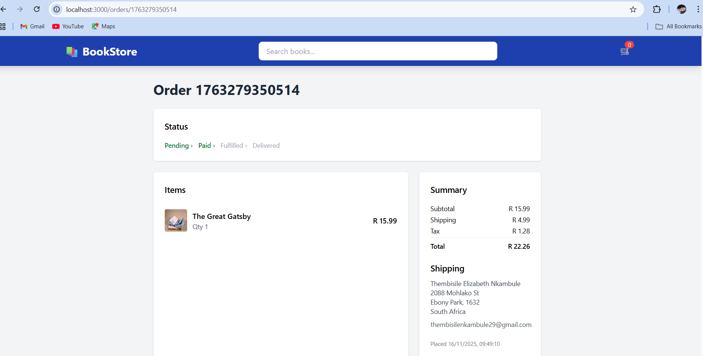

- **ID:** TC-PAY-09
- **Title:** Verify an email is sent after successful purchase
- **Pre-conditions:** Invalid / missing Paystack key in `.env`
- **Steps:**
  1. On `/cart`
  2. Click "Proceed to Checkout"
  3. Fill in the form
  4. Click "Next"
  5. Click "Proceed to Payment"
  6. Click "Pay Now"
  7. Click "Card"
  8. Click "Success"
- **Expected Result:** Email is succesfully received
- **Post-conditions:** 
- **Evidence:**  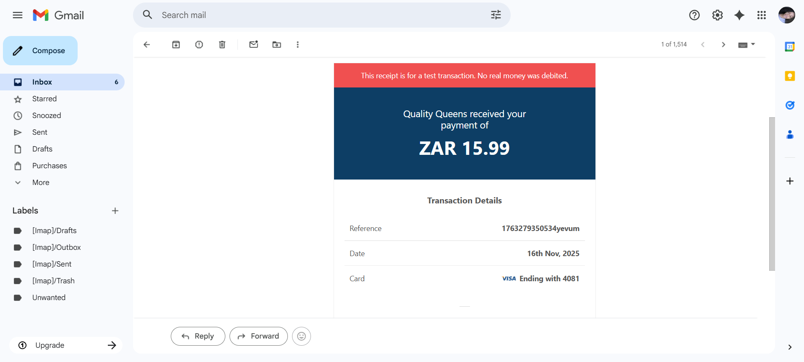

## 4. Admin Inventory Management

- **ID:** TC-ADMIN-01
- **Title:** Verify admin can login
- **Pre-conditions:** Web browser terminal, User session role = admin
- **Steps:**
  1. Open the launch web browser terminal
  2. Type `localStorage.setItem('app.user', JSON.stringify({ role: 'admin' }))`
  3. http://localhost:3000/admin
- **Expected Result:** Redirects to Admin Dashboard
- **Post-conditions:** None
- **Evidence:**  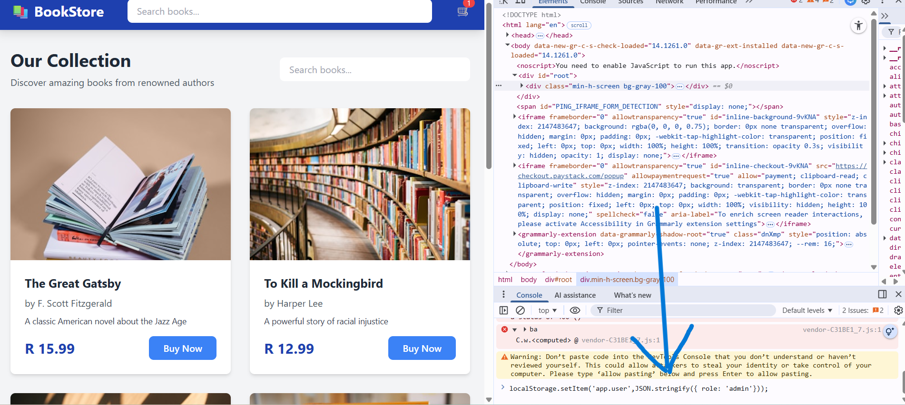

- **ID:** TC-ADMIN-02
- **Title:** Verify non-admin cannot access /admin
- **Pre-conditions:** Web browser terminal, User session role = admin
- **Steps:**
  1. Open the launch web browser terminal
  2. Type `localStorage.setItem('app.user', JSON.stringify({ role: 'admin' }))`
  3. http://localhost:3000/admin
- **Expected Result:** Error "Unauthorised user"
- **Post-conditions:** None
- **Evidence:**  

- **ID:** TC-ADMIN-03
- **Title:** Verify admin can create new item
- **Pre-conditions:** Web browser terminal, User session role = admin
- **Steps:**
  1. Open the launch web browser terminal
  2. Type `localStorage.setItem('app.user', JSON.stringify({ role: 'admin' }))`
  3. http://localhost:3000/admin
  4. Click "Catalog CRUD"
- **Expected Result:** Book saved and visible
- **Post-conditions:** None
- **Evidence:**  

- **ID:** TC-ADMIN-04
- **Title:** Verify existing book can be updated
- **Pre-conditions:** Web browser terminal, User session role = admin
- **Steps:**
  1. Open the launch web browser terminal
  2. Type `localStorage.setItem('app.user', JSON.stringify({ role: 'admin' }))`
  3. http://localhost:3000/admin
  4. Click "Catalog CRUD"
- **Expected Result:** Changes persist successfully
- **Post-conditions:** None
- **Evidence:**  

- **ID:** TC-ADMIN-05
- **Title:**  Verify admin can delete inventory item
- **Pre-conditions:** Web browser terminal, User session role = admin
- **Steps:**
  1. Open the launch web browser terminal
  2. Type `localStorage.setItem('app.user', JSON.stringify({ role: 'admin' }))`
  3. http://localhost:3000/admin
  4. Click "Catalog CRUD"
- **Expected Result:** Book removed from list
- **Post-conditions:** None
- **Evidence:**  

---

## 5. Non‑Functional Requirements

- **ID:** TC-NFR-01
- **Title:** Verify can work in every screen size
- **Pre-conditions:** 
- **Steps:**
  1. Navigate to `/catalog`
- **Expected Result:** Layout adapts correctly with no overlap
- **Post-conditions:** None
- **Evidence:**  

- **ID:** TC-NFR-02
- **Title:** Prevent incorrect or empty data
- **Pre-conditions:**
- **Steps:**
  1. Navigate to `/catalog`
- **Expected Result:** Display error message
- **Post-conditions:** None
- **Evidence:**  .png)  .png)

- **ID:** TC-NFR-03
- **Title:** Ensure all UI is accessible via keyboard
- **Pre-conditions:**
- **Steps:**
  1. Navigate to `/catalog`
- **Expected Result:** Navigate successfully
- **Post-conditions:** None
- **Evidence:**

- **ID:** TC-NFR-04
- **Title:** Ensure images load lazily
- **Pre-conditions:**
- **Steps:**
  1. Navigate to `/catalog`
- **Expected Result:** Images load only when in viewport
- **Post-conditions:** None
- **Evidence:**
